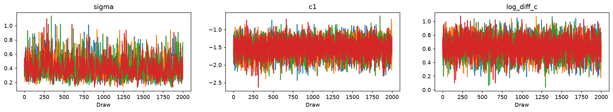
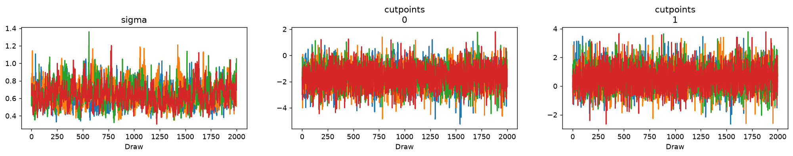
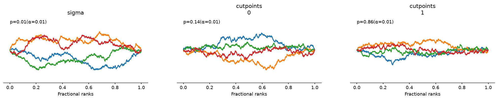
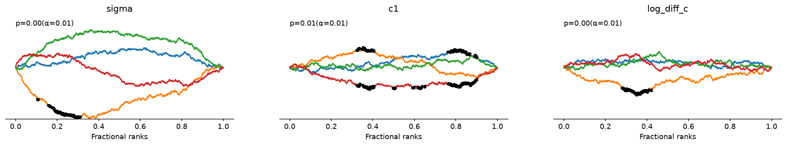
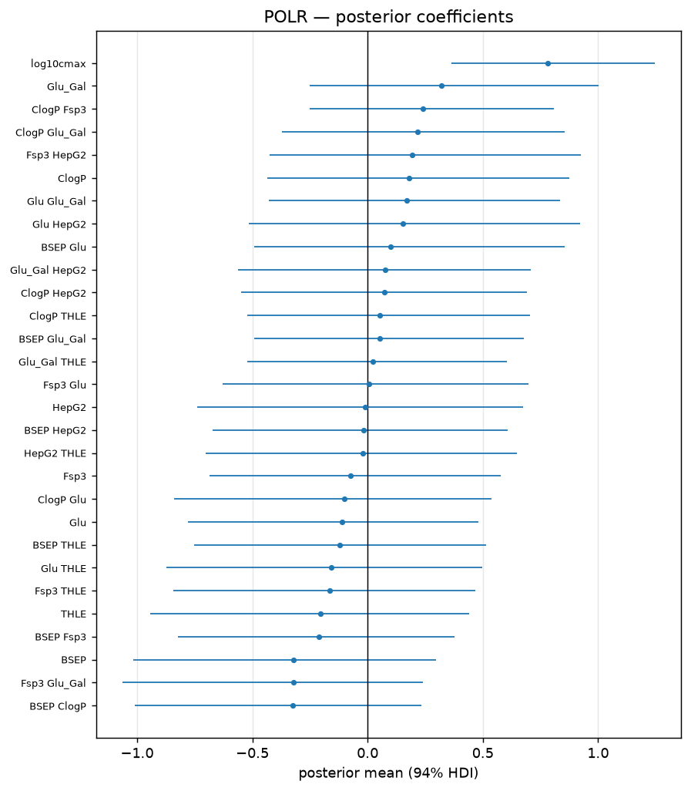
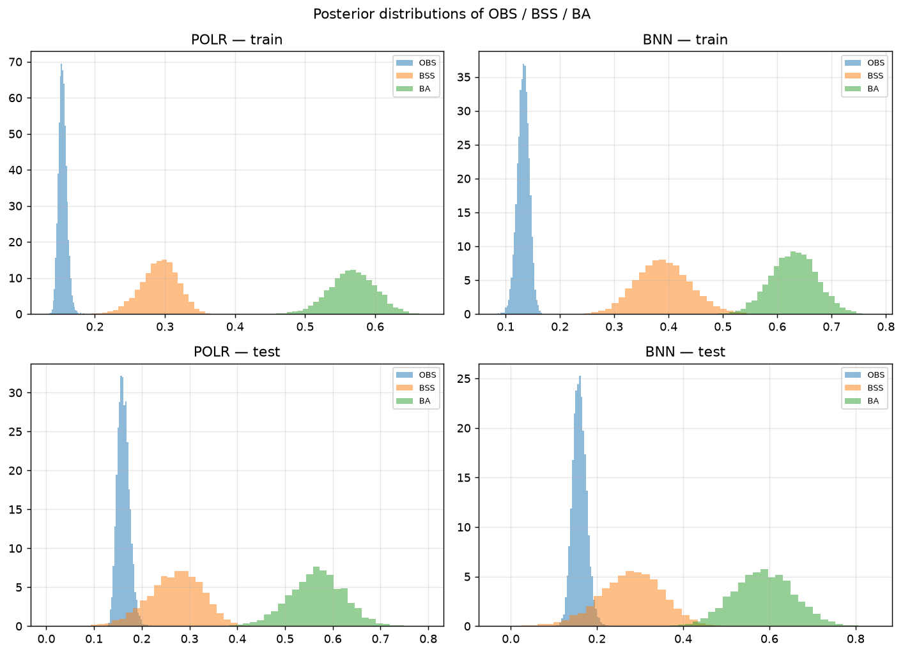
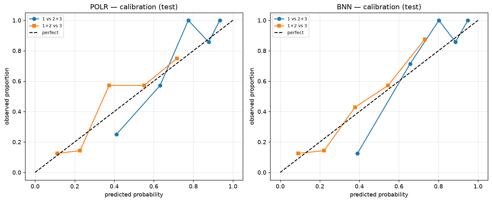
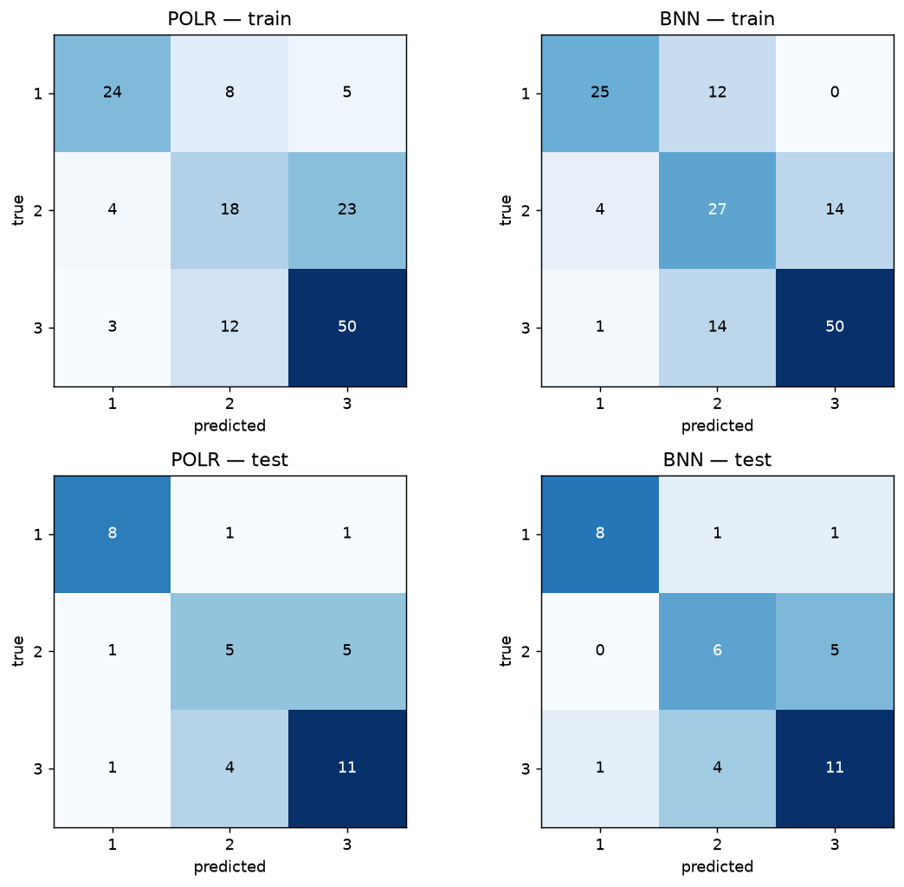
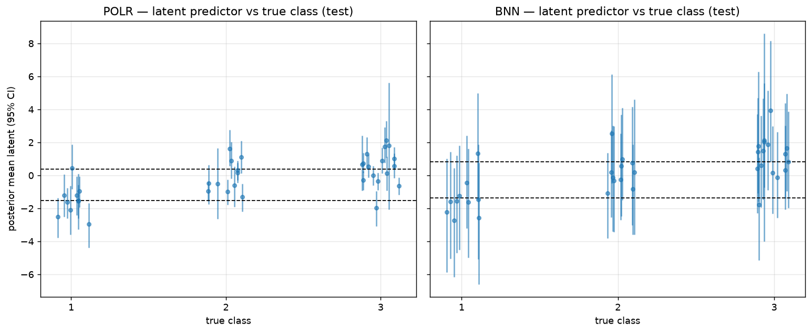

# Bayesian DILI Severity Prediction

Bayesian models for predicting the severity of **drug-induced liver injury (DILI)**
from in-vitro assay data and physicochemical properties. The three-class ordinal
outcome is:

| Label | Meaning |
|---|---|
| 1 | No DILI concern (safe) |
| 2 | Less DILI concern (moderate) |
| 3 | Most DILI concern (severe) |

The work reproduces the models from:

> Semenova, Williams, Afzal & Lazic (2020), *A Bayesian neural network for toxicity
> prediction*, Computational Toxicology 16:100133
> ([bioRxiv 2020.04.28.065532](https://doi.org/10.1101/2020.04.28.065532)).

The paper's **baseline** is a Bayesian proportional-odds logistic regression (POLR);
its **proposed** model is a Bayesian neural network (BNN). Both are reimplemented here
in PyMC. The authors' original Julia/Turing implementation is available at
[elizavetasemenova/BNN_tox](https://github.com/elizavetasemenova/BNN_tox) and was used
to make this a code-faithful reproduction.

---

## Data

- Source: Aleo et al. (2019), as used by the paper.
- 237 labelled compounds; the 184 with severity 1/2/3 are used.
- Stratified split: **147 train / 37 test**.
- 8 predictors: `ClogP`, `BSEP`, `Glu`, `Glu_Gal`, `THLE`, `HepG2`, `Fsp3`, `log10cmax`.
- Class counts — train: 37 / 45 / 65, test: 10 / 11 / 16.

Files: `data/01_raw/training_data.csv`, `data/01_raw/test_data.csv`
(parquet copies `train_df.parquet`, `test_df.parquet`).

---

## Models

Model specification following the authors' released code (used by
`scripts/code_faithful.py` and `scripts/make_figures.py`, and for the results below).
The exploratory notebooks (`notebooks/baseline.ipynb`, `notebooks/bnn.ipynb`) implement
the paper's Eq. 1-2 instead (ordered `Normal(0, 20)` cutpoints, no BNN bias).

**POLR baseline**

```
eta = X w                          # X: 147 x 29 (8 main effects + 21 interactions,
w ~ Normal(0, sigma^2)             #    Cmax interactions excluded)
sigma ~ HalfNormal(1)
y ~ OrderedLogistic(eta, [c1, c2])
c1 ~ Normal(0, 20),  c2 = c1 + exp(Normal(0, 2))
```

**BNN**

```
h = ReLU(X w01 + b01)              # X: 147 x 8 (main effects only)
eta = h w12                        # one hidden layer, 15 nodes
w01, b01, w12 ~ Normal(0, sigma^2) # hidden-layer bias only, no output bias
sigma ~ HalfNormal(1)
y ~ OrderedLogistic(eta, [c1, c2])
c1 ~ Normal(0, 20),  c2 = c1 + exp(Normal(0, 2))
```

The priors differ from the paper's Eq. 1-2 in two ways: the cutpoints use a
**log-normal gap** (`c2 = c1 + exp(N(0,2))`) rather than an ordered `Normal(0, 20)`
pair, and the BNN hidden layer **includes biases**.

Both use NUTS, posterior-distribution metrics, and the paper's evaluation protocol
(WAIC, balanced accuracy, ordered Brier score, Brier skill score, bootstrap resampling,
calibration).

### PyMC 6.3 implementation notes

- Inputs are standardised. The released code does not scale inputs, but the raw assay
  values (`max|x| = 90000`) make the likelihood numerically infeasible in PyMC
  (`-inf` at initialisation) and fit poorly (WAIC 303 / 290 with divergences), so
  standardising was required.
- `pm.OrderedLogistic` underflows to `-inf` for large `|eta|`. A mathematically
  identical log1mexp formulation is used via `pm.Potential`.
- ArviZ 1.x removed `az.waic`; WAIC is computed from the posterior directly.

---

## Results

All metrics are the mean (and, where shown, median) of the **per-posterior-draw**
distribution, matching the paper. WAIC is in-sample only.

### Full model — code-faithful reproduction vs the paper

| Metric | Paper POLR | POLR (this repo) | Paper BNN | BNN (this repo) |
|---|---|---|---|---|
| **WAIC** | 267.3 | 268.4 | 252.8 | **252.6** |
| OBS mean train / test | 0.14 / 0.16 | 0.154 / 0.162 | 0.12 / 0.14 | 0.133 / 0.160 |
| BSS mean train / test | 0.24 / 0.20 | 0.291 / 0.270 | 0.37 / 0.31 | 0.390 / 0.279 |
| BA train / test | 0.61 / 0.61 | 0.567 / 0.567 | 0.70 / 0.67 | 0.629 / 0.585 |

The headline result reproduces closely: **the BNN improves WAIC by ~16 points over the
POLR** (268.4 → 252.6) versus the paper's ~14.5-point gap, and the BNN WAIC matches the
paper to within **0.2 points** (252.6 vs 252.8). In-sample the BNN improves every
metric; on the test set the two models are close, with the BNN ahead on accuracy and
class-2 recall. The paper's BNN test advantage (BA 0.67 vs 0.61) is larger than
reproduced here (0.585 vs 0.567).

### Extended metrics (code-faithful, posterior mean)

| Metric | POLR train | POLR test | BNN train | BNN test |
|---|---|---|---|---|
| Accuracy | 0.591 | 0.581 | 0.645 | 0.594 |
| Balanced accuracy | 0.567 | 0.567 | 0.629 | 0.585 |
| OBS | 0.154 | 0.162 | 0.133 | 0.160 |
| BSS | 0.291 | 0.270 | 0.390 | 0.279 |
| Brier 1 vs 2+3 | 0.129 | 0.126 | 0.110 | 0.125 |
| BSS 1 vs 2+3 | 0.313 | 0.364 | 0.417 | 0.366 |
| Brier 1+2 vs 3 | 0.179 | 0.198 | 0.156 | 0.194 |
| BSS 1+2 vs 3 | 0.275 | 0.195 | 0.369 | 0.209 |

### Bootstrap (paper Table 3)

20 resamples of the 147 training compounds; median (SD) over the resamples.

| Metric (OOS / test) | Paper BNN | BNN (this repo) |
|---|---|---|
| OBS | 0.08 (0.02) / 0.08 (0.02) | 0.250 (0.032) / 0.245 (0.030) |
| BSS | 0.57 (0.13) / 0.59 (0.13) | -0.154 (0.157) / -0.105 (0.136) |
| BA | 0.61 (0.05) / 0.60 (0.04) | 0.540 (0.030) / 0.540 (0.030) |

**This is the one result that does not reproduce.** In this PyMC reimplementation the
BNN overfits the resampled data (the shared scale `sigma` inflates and out-of-sample
BSS goes negative). The authors' bootstrap code was **not released**, so the difference
cannot be checked against the original; it may reflect the unreleased procedure, the
data scale, or the posterior-predictive sampling the code uses to estimate class
probabilities. The full-model results above are unaffected.

### Reproduction fidelity

The paper's equations are an incomplete description of the released code. Matching the
code (cutpoint prior, hidden biases, sampler settings) moved the BNN WAIC from 254.8 to
**252.6**, essentially exact. The two remaining differences are the input scale (the
code does not standardise, which is infeasible with these raw values in PyMC) and the
unreleased bootstrap.

Saved outputs: `data/08_reporting/polr_full_metrics.csv`,
`bnn_full_metrics.csv`, `model_performance_metrics.csv`,
`code_faithful_results.csv`, `bnn_bootstrap_results.csv`, `bnn_bootstrap_summary.csv`.

> The `polr_bootstrap_*.csv` files predate the corrected baseline and are stale;
> rerun `notebooks/baseline.ipynb` cells 13–18 to regenerate them.

---

## Extension: chemical representations (SMILES / RDKit)

`scripts/structure_extension.py` tests the paper's suggested future work — *"including
chemical representation of molecules into the model"* — with regularisation for the
high-dimensional structure block. SMILES for the 184 compounds are resolved from
PubChem and encoded as RDKit **MACCS keys** (167 bits). Fixed dataset and split;
20-bootstrap SDs on the test set.

### Ablation (frequentist, test set)

| Block | Model | OBS | BSS | BA | Acc |
|---|---|---|---|---|---|
| frequency | — | 0.221 | 0.000 | 0.333 | 0.432 |
| assay | logreg (L2) | 0.161 | 0.273 | 0.560 | 0.568 |
| assay | random forest | 0.176 | 0.205 | 0.505 | 0.514 |
| structure | logreg (L1) | 0.183 | 0.174 | 0.599 | 0.595 |
| structure | gradient boosting | 0.164 | 0.259 | 0.692 | 0.703 |
| combined | logreg (L2) | 0.152 | 0.314 | 0.633 | 0.622 |
| **combined** | **random forest** | **0.160** | **0.278** | **0.695** | **0.703** |

### Bayesian models (combined = 8 assay + 15 structure PCs)

Assay-only references (code-faithful): POLR WAIC 268.4, BNN WAIC 252.6.

| Model | Prior | WAIC | OBS test | BSS test | BA test |
|---|---|---|---|---|---|
| POLR assay-only | weak | 268.4 | 0.162 | 0.270 | 0.567 |
| POLR combined | weak | 267.8 | 0.159 | 0.283 | 0.520 |
| POLR combined | **horseshoe** | 263.8 | 0.159 | 0.281 | **0.571** |
| BNN assay-only | weak | 252.6 | 0.160 | 0.279 | 0.585 |
| BNN combined | weak | 264.3 | 0.155 | 0.299 | 0.456 |
| **BNN combined** | **horseshoe** | 254.3 | **0.145** | **0.344** | **0.605** |

### Findings

- **Structure carries signal** — structure-only models reach BA 0.69 / BSS 0.26, far
  above the frequency baseline (0.33 / 0.00).
- **Structure is complementary** — combined assay + structure is the best frequentist
  model (RF: BA 0.695, BSS 0.278 ± 0.043).
- **Regularisation is decisive for the Bayesian models.** The weak-prior combined BNN
  collapses (BA 0.456), but the horseshoe prior restores it to BA 0.605 with the best
  out-of-sample OBS (0.145) and BSS (0.344) of any Bayesian model — improving on the
  assay-only BNN (OBS 0.160, BSS 0.279, BA 0.585).
- **Caveat:** the test set is 37 compounds; judge differences against the bootstrap SDs.

Output: `data/08_reporting/structure_extension_results.csv`,
`data/08_reporting/original_compounds_smiles.csv`.

---

## Figures

Model-fitting and diagnostic visualisations, generated by `scripts/make_figures.py`
(`python scripts/make_figures.py`):

**MCMC convergence** — trace and rank plots for `sigma`, `c1` and `log_diff_c`.

| POLR | BNN |
|---|---|
|  |  |
|  |  |

**Posterior coefficients** — POLR weights with 94% HDI.



**Posterior metric distributions** — per-draw OBS / BSS / BA (paper Figs 9–10 analogue).



**Calibration** — 1 vs 2+3 and 1+2 vs 3 (paper Appendix D).



**Confusion matrices** — posterior-mean predictions.



**Latent predictor vs true class** — posterior mean with 95% CI and estimated cutpoints
(paper Fig 8 analogue).



---

## Reproducing

Requires Python >= 3.12. Dependencies are managed with [uv](https://docs.astral.sh/uv/):

```bash
uv sync
```

Then open the notebooks / run the scripts:

| File | Contents |
|---|---|
| `notebooks/baseline.ipynb` | POLR baseline (paper's Eq. 1): fit, metrics, calibration, bootstrap |
| `notebooks/bnn.ipynb` | BNN (paper's Eq. 2): fit, metrics, calibration, bootstrap (Colab-ready) |
| `scripts/code_faithful.py` | Code-faithful POLR + BNN reproduction (raw vs standardised inputs) |
| `scripts/structure_extension.py` | Structure (SMILES/MACCS) ablation + regularised Bayesian models |
| `scripts/make_figures.py` | Regenerates all figures in `figures/` |
| `notebooks/structure_extension.ipynb` | Results notebook for the extension |
| `notebooks/eda.ipynb` | Exploratory data analysis |

`notebooks/bnn.ipynb` is self-contained for Google Colab: it installs missing
dependencies, falls back to `files.upload()` for the parquet inputs, and exposes
`CONFIG` / `N_BOOTSTRAP` knobs. The full BNN fits in well under a minute on CPU;
the 20-bootstrap loop takes ~20 minutes.

---

## Limitations

- The paper's equations (Eq. 1-2) do not fully match the released code (cutpoint prior,
  hidden biases, input scaling). This repo follows the code; the full-model WAIC then
  reproduces to within **0.2 points** (BNN) and **1.1 points** (POLR).
- The authors' **bootstrap code was not released**, so the paper's Table 3 could not be
  verified; the bootstrap is the only result that does not reproduce here.
- Inputs are standardised. The released code feeds raw values, which is numerically
  infeasible in PyMC; this is the main remaining implementation difference.
- Assay values were treated as observed; censoring was not modelled (as in the paper).
- The paper's non-Bayesian NN comparison (dropout / L2 penalty grids, multiclass BNN)
  and its label-permutation test are not yet implemented.
